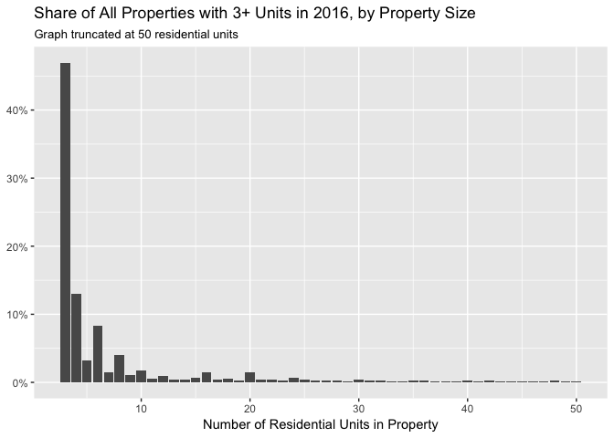
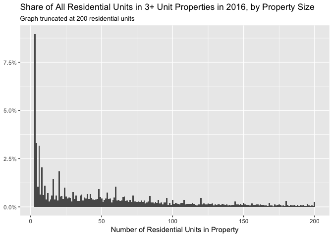
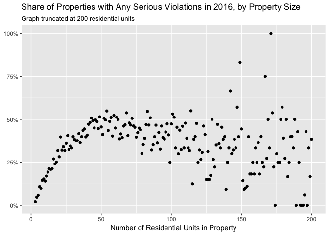
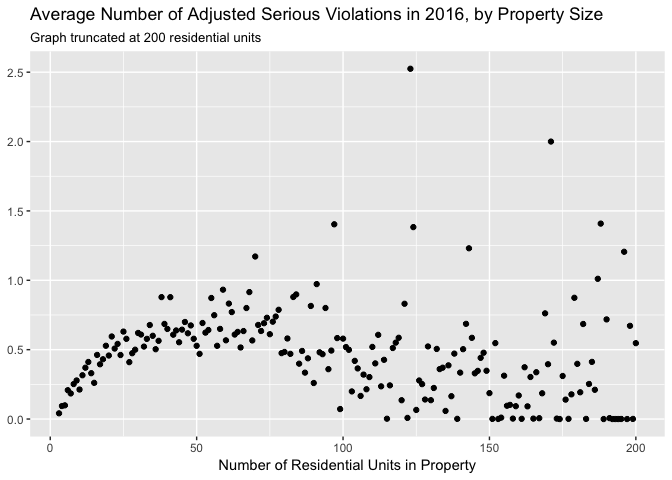
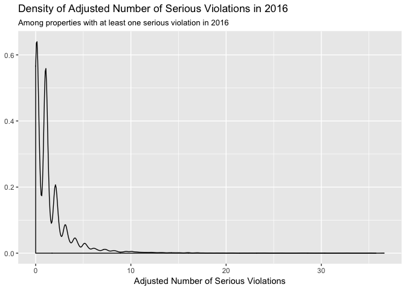

Predicting Housing Code Violations
================
Maxwell Austensen
2017-02-26

``` r
library(tidyverse)
```

``` r
df <- feather::read_feather("../data/merged.feather") %>% 
  mutate(viol_c_all_2016 = viol_bldg_c_2016 + viol_apt_c_2016,
         viol_c_all_2015 = viol_bldg_c_2015 + viol_apt_c_2015)
```

Small properties represent a very large share of all properties and contain a large share of all residential units.

``` r
df %>% 
  group_by(res_units) %>% 
  summarise(sh_all_bbls = n() / nrow(.)) %>%  
  filter(res_units <= 50) %>% 
  ggplot(aes(res_units, sh_all_bbls)) + 
  geom_col() + 
  scale_y_continuous(labels = scales::percent_format()) +
  labs(title = "Share of All Properties with 3+ Units in 2016, by Property Size",
       subtitle = "Graph truncated at 50 residential units",
       y = NULL, x = "Number of Residential Units in Property")
```



``` r
all_res_units <- sum(df$res_units)

df %>% 
  group_by(res_units) %>% 
  summarise(sh_all_units = sum(res_units) / all_res_units) %>%  
  filter(res_units <= 200) %>%
  ggplot(aes(res_units, sh_all_units)) + 
  geom_col(width = 1) + 
  scale_y_continuous(labels = scales::percent_format()) +
  labs(title = "Share of All Residential Units in 3+ Unit Properties in 2016, by Property Size",
       subtitle = "Graph truncated at 200 residential units",
       y = NULL, x = "Number of Residential Units in Property")
```



``` r
df %>% 
  filter(res_units <= 200) %>% 
  group_by(res_units) %>%
  summarise(any_serious_viol = mean(viol_c_all_2016 > 0)) %>% 
  filter(!is.na(res_units)) %>% 
  ggplot(aes(res_units, any_serious_viol)) + 
  geom_point() +
  scale_y_continuous(labels = scales::percent_format()) +
  labs(title = "Share of Properties with Any Serious Violations in 2016, by Property Size",
       subtitle = "Graph truncated at 200 residential units",
       y = NULL, x = "Number of Residential Units in Property")
```



To get an overall score for each building we might want to adjust the violation counts for building size. Violations that affect a specific apartment are adjusted by the number of residential units, and violations that affect the entire building are not adjusted.

``` r
df %>% 
  filter(res_units <= 200) %>% 
  group_by(res_units) %>%
  summarise(avg_viol_c_all_2016 = mean(viol_c_all_2016, na.rm = TRUE)) %>% 
  ggplot(aes(res_units, avg_viol_c_all_2016)) + 
  geom_point() +
  labs(title = "Average Number of Adjusted Serious Violations in 2016, by Property Size",
       subtitle = "Graph truncated at 200 residential units",
       y = NULL, x = "Number of Residential Units in Property")
```



``` r
df %>% 
  filter(viol_c_all_2016 > 0) %>% 
  ggplot(aes(viol_c_all_2016)) + 
  geom_density() +
  labs(title = "Density of Adjusted Number of Serious Violations in 2016",
       subtitle = "Among properties with at least one serious violation in 2016",
       y = NULL, x = "Adjusted Number of Serious Violations")
```



``` r
sh_viol_16 <- mean(df$viol_c_all_2016)

viol_16_avg <- df %>% 
  filter(viol_c_all_2016 > 0) %>% 
  summarise(mean(viol_c_all_2016)) %>%
  .[[1]]
 
viol_16_no15 <- df %>% 
  filter(viol_c_all_2016 > 0) %>% 
  summarise(mean(viol_c_all_2015 > 0)) %>%
  .[[1]]
```

Only 15.8% of all properties with 3+ units had any serious violations in 2016. Among these properties that had any serious violations, the average number of adjusted serious violations was 1.6 in 2016. Of all the those properties that had at least one serious violation in 2016, 52% didn't have a serious violation in 2015.
