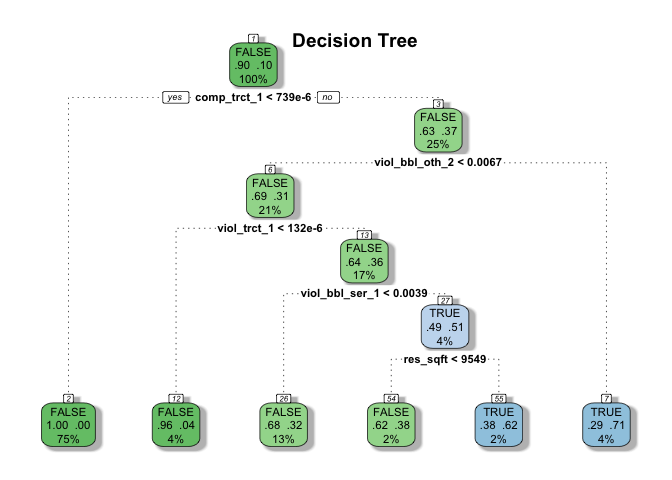

Violation Prediction Models - Binary
================

``` r
library(plyr)
library(rpart)
library(randomForest)
library(caret)
library(rattle)
library(magrittr)
library(stringr)
library(feather)
library(ROCR)
library(MASS)
library(tidyverse)

knitr::opts_knit$set(autodep=TRUE)
options(scipen = 10)

set.seed(2017)
```

Prep Data
=========

Create two data sets from training and testing models. The training data set (`df_15`) includes only violation data for 2013 and 2014 and two outcome variables, one indicator for whether the property had any serious violations in 2015, and on with the normalized count of serious violations that is weighted the by type of violation (apartment-specific, or building-wide) and the number of residential units in the building. The test data set (`df_16`) has violation data for 2014 and 2015 and the same two outcomes for 2016. The past years' violations indicators are renamed to be relative to the current year (eg. for 2015, 2014 becomes 1 and 2013 becomes 2). Later I plan to impute missing values, but for now I am simply dropping all records with missing data - There are realtively few now.

``` r
# If you cloned this repo but haven't run "make_data.R" then you'll only have 
# A zipped version of this file, so it needs to be unzipped first
if (!exists("../data/merged.feather")) {
  unzip("../data/merged.zip", files = "data/merged.feather", exdir = "../data")
  file.rename("../data/data/merged.feather", "../data/merged.feather")
  file.remove("../data/data")
}

df <- read_feather("../data/merged.feather")

tot_obs <- nrow(df)

df <- drop_na(df)
```

There are only 2174 records dropped because of missings.

``` r
df_15 <- df %>% 
  mutate(outcome_b = factor(viol_bbl_ser_2015 > 0),
         outcome_r = viol_bbl_ser_2015) %>% 
  select(-matches("2015|2016$"), -bbl) %>% 
  set_names(names(.) %>% str_replace_all("2014", "1") %>% str_replace_all("2013", "2"))

df_15_b <- select(df_15, -outcome_r, outcome = outcome_b)
df_15_r <- select(df_15, -outcome_b, outcome = outcome_r)


df_16 <- df %>% 
  mutate(outcome_b = factor(viol_bbl_ser_2016 > 0),
         outcome_r = viol_bbl_ser_2016) %>% 
  select(-matches("2013|2016$"), -bbl) %>% 
  set_names(names(.) %>% str_replace_all("2015", "1") %>% str_replace_all("2014", "2"))

df_16_b <- select(df_16, -outcome_r, outcome = outcome_b)
df_16_r <- select(df_16, -outcome_b, outcome = outcome_r)
```

------------------------------------------------------------------------

Serious violations in previous year
===================================

First I'll just simply use the presence of serious violations in 2015 to predict for 2016.

``` r
(past_viol_info <- confusionMatrix(df_15_b[["outcome"]], df_16_b[["outcome"]], 
                            positive = "TRUE", mode = "everything"))
```

    ## Confusion Matrix and Statistics
    ## 
    ##           Reference
    ## Prediction  FALSE   TRUE
    ##      FALSE 129284   7070
    ##      TRUE    7009   7931
    ##                                           
    ##                Accuracy : 0.9069          
    ##                  95% CI : (0.9055, 0.9084)
    ##     No Information Rate : 0.9008          
    ##     P-Value [Acc > NIR] : 6.218e-16       
    ##                                           
    ##                   Kappa : 0.4781          
    ##  Mcnemar's Test P-Value : 0.6131          
    ##                                           
    ##             Sensitivity : 0.52870         
    ##             Specificity : 0.94857         
    ##          Pos Pred Value : 0.53086         
    ##          Neg Pred Value : 0.94815         
    ##               Precision : 0.53086         
    ##                  Recall : 0.52870         
    ##                      F1 : 0.52978         
    ##              Prevalence : 0.09915         
    ##          Detection Rate : 0.05242         
    ##    Detection Prevalence : 0.09875         
    ##       Balanced Accuracy : 0.73864         
    ##                                           
    ##        'Positive' Class : TRUE            
    ## 

Using the presence of serious violations in 2015 to predict violations for 2016 achieves an accuracy of 0.9069428, which is only a slight improvement over the no information rate of 0.9008487. This simple prediction has a Kappa statistic of 0.4781373, its precision is 0.5308568 and recall is 0.5286981.

------------------------------------------------------------------------

Logit
=====

Next I fit a Logit model using all the attributes for the `df_15` training data set. I then get the predicted values on the `df_16` test data and iterate over threshold values, deciding on 0.5.

``` r
glm_fit <- glm("outcome ~ .", family = "binomial", data = df_15_b)

glm_p <- predict(glm_fit, df_16_b, type = "response")

print_results <- function(threshold, preditions) {
  ret <- if_else(preditions > threshold, TRUE, FALSE) %>% 
    as.factor() %>% 
    confusionMatrix(df_16_b[["outcome"]], positive = "TRUE", mode = "everything")
  
  message(str_c("\nThreshold: ", threshold))
  print(ret)
}

# Use this to select a theshold - decided on 0.7
# walk(seq(0.4, 0.8, 0.05), print_results, preditions = glm_p)

(glm_info <- confusionMatrix(as.factor(glm_p > 0.7), df_16_b[["outcome"]], 
                             positive = "TRUE", mode = "everything"))
```

    ## Confusion Matrix and Statistics
    ## 
    ##           Reference
    ## Prediction  FALSE   TRUE
    ##      FALSE 128855   7077
    ##      TRUE    7438   7924
    ##                                           
    ##                Accuracy : 0.9041          
    ##                  95% CI : (0.9026, 0.9055)
    ##     No Information Rate : 0.9008          
    ##     P-Value [Acc > NIR] : 0.00001361      
    ##                                           
    ##                   Kappa : 0.4686          
    ##  Mcnemar's Test P-Value : 0.002807        
    ##                                           
    ##             Sensitivity : 0.52823         
    ##             Specificity : 0.94543         
    ##          Pos Pred Value : 0.51582         
    ##          Neg Pred Value : 0.94794         
    ##               Precision : 0.51582         
    ##                  Recall : 0.52823         
    ##                      F1 : 0.52195         
    ##              Prevalence : 0.09915         
    ##          Detection Rate : 0.05237         
    ##    Detection Prevalence : 0.10154         
    ##       Balanced Accuracy : 0.73683         
    ##                                           
    ##        'Positive' Class : TRUE            
    ## 

The Logit model achieves an accuracy of 0.904061, which is only a slight improvement over the previous year's violation prediction and even better than the no information rate of 0.9008487. The Logit model achieves a Kappa statistic of 0.4686396, its precision is 0.5158183, and recall is 0.5282315.

``` r
step_aic_fit <- MASS::stepAIC(glm_fit)
```

    ## Start:  AIC=57336.51
    ## outcome ~ assessed_value + basement_code + lot_area + res_sqft + 
    ##     boro + cd + floors + buildings + res_units + other_units + 
    ##     avg_res_unit_sqft + last_reno + zoning1 + building_class1 + 
    ##     viol_bbl_oth_2 + viol_bbl_oth_1 + viol_bbl_ser_2 + viol_bbl_ser_1 + 
    ##     viol_trct_2 + viol_trct_1 + lit_2 + lit_1 + comp_bbl_1 + 
    ##     comp_trct_1
    ## 
    ##                     Df Deviance   AIC
    ## - buildings          1    57127 57335
    ## - viol_trct_2        1    57127 57335
    ## <none>                    57127 57337
    ## - res_sqft           1    57131 57339
    ## - boro               2    57133 57339
    ## - lot_area           1    57133 57341
    ## - zoning1            4    57144 57346
    ## - viol_trct_1        1    57142 57350
    ## - viol_bbl_ser_2     1    57154 57362
    ## - avg_res_unit_sqft  1    57168 57376
    ## - last_reno          1    57173 57381
    ## - floors             1    57188 57396
    ## - res_units          1    57192 57400
    ## - other_units        1    57196 57404
    ## - viol_bbl_ser_1     1    57198 57406
    ## - viol_bbl_oth_2     1    57232 57440
    ## - lit_2              1    57304 57512
    ## - lit_1              1    57309 57517
    ## - viol_bbl_oth_1     1    57331 57539
    ## - basement_code      5    57454 57654
    ## - assessed_value     1    57487 57695
    ## - building_class1   15    57732 57912
    ## - comp_bbl_1         1    57731 57939
    ## - cd                57    57902 57998
    ## - comp_trct_1        1    65337 65545
    ## 
    ## Step:  AIC=57334.52
    ## outcome ~ assessed_value + basement_code + lot_area + res_sqft + 
    ##     boro + cd + floors + res_units + other_units + avg_res_unit_sqft + 
    ##     last_reno + zoning1 + building_class1 + viol_bbl_oth_2 + 
    ##     viol_bbl_oth_1 + viol_bbl_ser_2 + viol_bbl_ser_1 + viol_trct_2 + 
    ##     viol_trct_1 + lit_2 + lit_1 + comp_bbl_1 + comp_trct_1
    ## 
    ##                     Df Deviance   AIC
    ## - viol_trct_2        1    57127 57333
    ## <none>                    57127 57335
    ## - res_sqft           1    57131 57337
    ## - boro               2    57133 57337
    ## - lot_area           1    57135 57341
    ## - zoning1            4    57144 57344
    ## - viol_trct_1        1    57142 57348
    ## - viol_bbl_ser_2     1    57154 57360
    ## - avg_res_unit_sqft  1    57168 57374
    ## - last_reno          1    57173 57379
    ## - floors             1    57188 57394
    ## - res_units          1    57192 57398
    ## - other_units        1    57196 57402
    ## - viol_bbl_ser_1     1    57198 57404
    ## - viol_bbl_oth_2     1    57232 57438
    ## - lit_2              1    57304 57510
    ## - lit_1              1    57309 57515
    ## - viol_bbl_oth_1     1    57331 57537
    ## - basement_code      5    57454 57652
    ## - assessed_value     1    57495 57701
    ## - building_class1   15    57741 57919
    ## - comp_bbl_1         1    57731 57937
    ## - cd                57    57902 57996
    ## - comp_trct_1        1    65337 65543
    ## 
    ## Step:  AIC=57332.69
    ## outcome ~ assessed_value + basement_code + lot_area + res_sqft + 
    ##     boro + cd + floors + res_units + other_units + avg_res_unit_sqft + 
    ##     last_reno + zoning1 + building_class1 + viol_bbl_oth_2 + 
    ##     viol_bbl_oth_1 + viol_bbl_ser_2 + viol_bbl_ser_1 + viol_trct_1 + 
    ##     lit_2 + lit_1 + comp_bbl_1 + comp_trct_1
    ## 
    ##                     Df Deviance   AIC
    ## <none>                    57127 57333
    ## - res_sqft           1    57131 57335
    ## - boro               2    57133 57335
    ## - lot_area           1    57135 57339
    ## - zoning1            4    57144 57342
    ## - viol_bbl_ser_2     1    57155 57359
    ## - viol_trct_1        1    57158 57362
    ## - avg_res_unit_sqft  1    57168 57372
    ## - last_reno          1    57173 57377
    ## - floors             1    57188 57392
    ## - res_units          1    57192 57396
    ## - other_units        1    57196 57400
    ## - viol_bbl_ser_1     1    57198 57402
    ## - viol_bbl_oth_2     1    57233 57437
    ## - lit_2              1    57304 57508
    ## - lit_1              1    57309 57513
    ## - viol_bbl_oth_1     1    57331 57535
    ## - basement_code      5    57454 57650
    ## - assessed_value     1    57495 57699
    ## - building_class1   15    57741 57917
    ## - comp_bbl_1         1    57731 57935
    ## - cd                57    57902 57994
    ## - comp_trct_1        1    65362 65566

``` r
step_aic_p <- predict(step_aic_fit, df_16_b, type = "response")
```

    ## Warning in predict.lm(object, newdata, se.fit, scale = 1, type =
    ## ifelse(type == : prediction from a rank-deficient fit may be misleading

``` r
# Use this to select a theshold - decided on 0.7
# walk(seq(0.6, .8, 0.025), print_results, preditions = step_aic_p)

(step_aic_info <- confusionMatrix(as.factor(step_aic_p > 0.7), df_16_b[["outcome"]], 
                             positive = "TRUE", mode = "everything"))
```

    ## Confusion Matrix and Statistics
    ## 
    ##           Reference
    ## Prediction  FALSE   TRUE
    ##      FALSE 128914   7096
    ##      TRUE    7379   7905
    ##                                           
    ##                Accuracy : 0.9043          
    ##                  95% CI : (0.9028, 0.9058)
    ##     No Information Rate : 0.9008          
    ##     P-Value [Acc > NIR] : 0.00000277      
    ##                                           
    ##                   Kappa : 0.4689          
    ##  Mcnemar's Test P-Value : 0.01908         
    ##                                           
    ##             Sensitivity : 0.52696         
    ##             Specificity : 0.94586         
    ##          Pos Pred Value : 0.51721         
    ##          Neg Pred Value : 0.94783         
    ##               Precision : 0.51721         
    ##                  Recall : 0.52696         
    ##                      F1 : 0.52204         
    ##              Prevalence : 0.09915         
    ##          Detection Rate : 0.05225         
    ##    Detection Prevalence : 0.10102         
    ##       Balanced Accuracy : 0.73641         
    ##                                           
    ##        'Positive' Class : TRUE            
    ## 

``` r
glm_correct <- (as.factor(glm_p > 0.7) == df_16_b[["outcome"]])
step_aic_correct <- (as.factor(step_aic_p > 0.7) == df_16_b[["outcome"]])

mcnemar.test(table(glm_correct, step_aic_correct))
```

    ## 
    ##  McNemar's Chi-squared test with continuity correction
    ## 
    ## data:  table(glm_correct, step_aic_correct)
    ## McNemar's chi-squared = 19.012, df = 1, p-value = 0.00001299

The p-value of indicates that the marginal improvements `MASS::stepAIC()` made to the logistic model are not statistically significant.

``` r
summary(step_aic_fit)
```

    ## 
    ## Call:
    ## glm(formula = outcome ~ assessed_value + basement_code + lot_area + 
    ##     res_sqft + boro + cd + floors + res_units + other_units + 
    ##     avg_res_unit_sqft + last_reno + zoning1 + building_class1 + 
    ##     viol_bbl_oth_2 + viol_bbl_oth_1 + viol_bbl_ser_2 + viol_bbl_ser_1 + 
    ##     viol_trct_1 + lit_2 + lit_1 + comp_bbl_1 + comp_trct_1, family = "binomial", 
    ##     data = df_15_b)
    ## 
    ## Deviance Residuals: 
    ##     Min       1Q   Median       3Q      Max  
    ## -5.6706  -0.2484  -0.1897  -0.1488   4.3704  
    ## 
    ## Coefficients: (2 not defined because of singularities)
    ##                     Estimate Std. Error z value Pr(>|z|)    
    ## (Intercept)       -2.551e+01  6.012e+04   0.000 0.999661    
    ## assessed_value    -1.689e-07  1.065e-08 -15.859  < 2e-16 ***
    ## basement_code1    -2.494e-01  7.450e-02  -3.347 0.000817 ***
    ## basement_code2     2.722e-01  6.569e-02   4.143 3.43e-05 ***
    ## basement_code3    -3.303e-01  5.475e-01  -0.603 0.546317    
    ## basement_code4    -2.319e-01  2.700e-01  -0.859 0.390367    
    ## basement_code5     4.682e-01  6.606e-02   7.088 1.36e-12 ***
    ## lot_area           3.718e-06  1.340e-06   2.774 0.005539 ** 
    ## res_sqft           2.758e-06  1.355e-06   2.035 0.041844 *  
    ## boro2             -1.067e+00  4.198e-01  -2.541 0.011059 *  
    ## boro3             -7.533e-01  3.604e-01  -2.090 0.036625 *  
    ## boro4              8.551e+10  3.970e+12   0.022 0.982816    
    ## boro5             -5.955e-01  5.991e-01  -0.994 0.320265    
    ## cd102              2.373e-01  3.393e-01   0.699 0.484330    
    ## cd103              3.422e-01  3.348e-01   1.022 0.306624    
    ## cd104              4.291e-01  3.383e-01   1.268 0.204725    
    ## cd105              2.886e-01  3.736e-01   0.773 0.439796    
    ## cd106              2.855e-01  3.433e-01   0.832 0.405533    
    ## cd107              4.310e-01  3.351e-01   1.286 0.198366    
    ## cd108              4.128e-01  3.351e-01   1.232 0.218016    
    ## cd109              2.057e-01  3.399e-01   0.605 0.545106    
    ## cd110              8.237e-02  3.363e-01   0.245 0.806527    
    ## cd111              2.347e-01  3.386e-01   0.693 0.488181    
    ## cd112              6.704e-01  3.370e-01   1.990 0.046634 *  
    ## cd201              6.207e-01  5.435e-01   1.142 0.253441    
    ## cd202              8.353e-01  5.439e-01   1.536 0.124616    
    ## cd203              7.462e-01  5.427e-01   1.375 0.169096    
    ## cd204              1.183e+00  5.399e-01   2.190 0.028494 *  
    ## cd205              1.321e+00  5.400e-01   2.447 0.014397 *  
    ## cd206              7.481e-01  5.406e-01   1.384 0.166429    
    ## cd207              8.564e-01  5.388e-01   1.589 0.111957    
    ## cd208              1.029e+00  5.189e-01   1.984 0.047259 *  
    ## cd209              4.609e-01  5.401e-01   0.853 0.393459    
    ## cd210              2.985e-01  5.504e-01   0.542 0.587644    
    ## cd211              3.601e-01  5.450e-01   0.661 0.508796    
    ## cd212              2.025e-01  5.405e-01   0.375 0.707915    
    ## cd301              2.754e-01  1.575e-01   1.749 0.080367 .  
    ## cd302              3.556e-01  1.738e-01   2.046 0.040768 *  
    ## cd303              1.419e-03  1.520e-01   0.009 0.992553    
    ## cd304             -4.550e-01  1.548e-01  -2.939 0.003293 ** 
    ## cd305             -4.924e-01  1.585e-01  -3.107 0.001889 ** 
    ## cd306              1.000e-01  1.689e-01   0.592 0.553748    
    ## cd307              4.949e-02  1.627e-01   0.304 0.760906    
    ## cd308              2.393e-02  1.566e-01   0.153 0.878523    
    ## cd309              4.026e-01  1.642e-01   2.452 0.014208 *  
    ## cd310              4.652e-01  1.681e-01   2.768 0.005643 ** 
    ## cd311              1.697e-01  1.617e-01   1.050 0.293848    
    ## cd312              3.548e-01  1.609e-01   2.205 0.027444 *  
    ## cd313              7.478e-01  1.799e-01   4.156 3.24e-05 ***
    ## cd314              9.241e-01  1.584e-01   5.834 5.42e-09 ***
    ## cd315              5.128e-01  1.755e-01   2.922 0.003482 ** 
    ## cd316             -8.494e-01  1.692e-01  -5.021 5.15e-07 ***
    ## cd317              3.388e-03  1.553e-01   0.022 0.982599    
    ## cd318                     NA         NA      NA       NA    
    ## cd401             -8.551e+10  3.970e+12  -0.022 0.982816    
    ## cd402             -8.551e+10  3.970e+12  -0.022 0.982816    
    ## cd403             -8.551e+10  3.970e+12  -0.022 0.982816    
    ## cd404             -8.551e+10  3.970e+12  -0.022 0.982816    
    ## cd405             -8.551e+10  3.970e+12  -0.022 0.982816    
    ## cd406             -8.551e+10  3.970e+12  -0.022 0.982816    
    ## cd407             -8.551e+10  3.970e+12  -0.022 0.982816    
    ## cd408             -8.551e+10  3.970e+12  -0.022 0.982816    
    ## cd409             -8.551e+10  3.970e+12  -0.022 0.982816    
    ## cd410             -8.551e+10  3.970e+12  -0.022 0.982816    
    ## cd411             -8.551e+10  3.970e+12  -0.022 0.982816    
    ## cd412             -8.551e+10  3.970e+12  -0.022 0.982816    
    ## cd413             -8.551e+10  3.970e+12  -0.022 0.982816    
    ## cd414             -8.551e+10  3.970e+12  -0.022 0.982816    
    ## cd482             -8.551e+10  3.970e+12  -0.022 0.982816    
    ## cd501             -7.615e-02  5.150e-01  -0.148 0.882440    
    ## cd502             -7.582e-01  6.388e-01  -1.187 0.235269    
    ## cd503                     NA         NA      NA       NA    
    ## floors             6.482e-02  8.357e-03   7.756 8.74e-15 ***
    ## res_units          9.456e-03  1.247e-03   7.585 3.31e-14 ***
    ## other_units        5.472e-02  7.347e-03   7.448 9.46e-14 ***
    ## avg_res_unit_sqft -3.415e-04  5.380e-05  -6.348 2.19e-10 ***
    ## last_reno         -2.324e-03  3.405e-04  -6.825 8.81e-12 ***
    ## zoning1C           2.341e+01  6.012e+04   0.000 0.999689    
    ## zoning1M           2.366e+01  6.012e+04   0.000 0.999686    
    ## zoning1N           2.263e+01  6.012e+04   0.000 0.999700    
    ## zoning1R           2.343e+01  6.012e+04   0.000 0.999689    
    ## building_class1C   2.935e+00  1.562e+00   1.879 0.060296 .  
    ## building_class1D   3.257e+00  1.563e+00   2.084 0.037152 *  
    ## building_class1E  -1.931e+01  2.535e+05   0.000 0.999939    
    ## building_class1F  -1.965e+01  3.493e+05   0.000 0.999955    
    ## building_class1H  -2.921e+01  7.555e+04   0.000 0.999691    
    ## building_class1I  -2.460e+01  1.438e+05   0.000 0.999864    
    ## building_class1K   2.292e+00  1.744e+00   1.314 0.188757    
    ## building_class1L   2.951e+01  3.608e+05   0.000 0.999935    
    ## building_class1M  -1.997e+01  1.227e+05   0.000 0.999870    
    ## building_class1N  -2.353e+01  1.953e+05   0.000 0.999904    
    ## building_class1O  -2.047e+01  9.147e+04   0.000 0.999821    
    ## building_class1R  -2.855e+00  1.634e+00  -1.747 0.080589 .  
    ## building_class1S   2.614e+00  1.563e+00   1.672 0.094445 .  
    ## building_class1U  -2.099e+01  3.494e+05   0.000 0.999952    
    ## building_class1W   1.452e+00  2.677e+00   0.543 0.587396    
    ## viol_bbl_oth_2     1.297e-01  1.315e-02   9.868  < 2e-16 ***
    ## viol_bbl_oth_1     1.179e-01  8.592e-03  13.721  < 2e-16 ***
    ## viol_bbl_ser_2     1.591e-01  3.093e-02   5.143 2.70e-07 ***
    ## viol_bbl_ser_1     1.376e-01  1.696e-02   8.111 5.04e-16 ***
    ## viol_trct_1        9.774e+00  1.732e+00   5.642 1.68e-08 ***
    ## lit_2              4.906e-01  3.789e-02  12.949  < 2e-16 ***
    ## lit_1              5.149e-01  3.890e-02  13.235  < 2e-16 ***
    ## comp_bbl_1         9.347e-02  4.394e-03  21.274  < 2e-16 ***
    ## comp_trct_1        7.361e+01  9.231e-01  79.743  < 2e-16 ***
    ## ---
    ## Signif. codes:  0 '***' 0.001 '**' 0.01 '*' 0.05 '.' 0.1 ' ' 1
    ## 
    ## (Dispersion parameter for binomial family taken to be 1)
    ## 
    ##     Null deviance: 97531  on 151293  degrees of freedom
    ## Residual deviance: 57127  on 151191  degrees of freedom
    ## AIC: 57333
    ## 
    ## Number of Fisher Scoring iterations: 25

------------------------------------------------------------------------

Decision Tree
=============

Next I try a simple decision tree with 10 times 10-fold Cross-validation.

``` r
tree_fit_control <- trainControl(method = "repeatedcv", number = 5, repeats = 2)

tree_fit <- train(form = outcome ~ ., 
                  data = df_15_b, 
                  method = "rpart", 
                  trControl = tree_fit_control)

tree_p <- predict(tree_fit, df_16_b)

(tree_info <- confusionMatrix(tree_p, df_16_b[["outcome"]], positive = "TRUE", mode = "everything"))
```

    ## Confusion Matrix and Statistics
    ## 
    ##           Reference
    ## Prediction  FALSE   TRUE
    ##      FALSE 128076   6122
    ##      TRUE    8217   8879
    ##                                           
    ##                Accuracy : 0.9052          
    ##                  95% CI : (0.9037, 0.9067)
    ##     No Information Rate : 0.9008          
    ##     P-Value [Acc > NIR] : 0.000000005105  
    ##                                           
    ##                   Kappa : 0.5005          
    ##  Mcnemar's Test P-Value : < 2.2e-16       
    ##                                           
    ##             Sensitivity : 0.59189         
    ##             Specificity : 0.93971         
    ##          Pos Pred Value : 0.51936         
    ##          Neg Pred Value : 0.95438         
    ##               Precision : 0.51936         
    ##                  Recall : 0.59189         
    ##                      F1 : 0.55326         
    ##              Prevalence : 0.09915         
    ##          Detection Rate : 0.05869         
    ##    Detection Prevalence : 0.11300         
    ##       Balanced Accuracy : 0.76580         
    ##                                           
    ##        'Positive' Class : TRUE            
    ## 

The decision tree's accuracy of 0.9052243, is a further improvement over the accuracy Logit model, the previous year's violation prediction, and no information rate. The decision tree model also achieves an improved Kappa statistic of 0.5005019, and its precision is 0.5193613, and recall is 0.5918939.

``` r
varImp(tree_fit)
```

    ## rpart variable importance
    ## 
    ##   only 20 most important variables shown (out of 106)
    ## 
    ##                  Overall
    ## viol_bbl_oth_1   100.000
    ## viol_bbl_ser_1    96.067
    ## comp_trct_1       89.788
    ## comp_bbl_1        82.085
    ## viol_bbl_oth_2    73.385
    ## viol_trct_1       26.508
    ## viol_trct_2       22.823
    ## res_sqft           5.614
    ## res_units          4.947
    ## assessed_value     1.461
    ## lot_area           1.432
    ## floors             1.429
    ## cd103              0.000
    ## cd102              0.000
    ## cd410              0.000
    ## cd317              0.000
    ## cd202              0.000
    ## zoning1C           0.000
    ## building_class1H   0.000
    ## cd305              0.000

As expected, the various indicators of a building's violation record in the current and previous year are the most important attributes for predicting the presence of serious violations in the subsequent year. Additionally, the building's total residential square footage and total lot area, as well as the number of residential units and the total assessed value in the current year are also important.

``` r
rattle::fancyRpartPlot(tree_fit$finalModel,
                       main = "Decision Tree", sub = "")
```



``` r
tree_correct <- (as.factor(tree_p) == df_16_b[["outcome"]])

mcnemar.test(table(tree_correct, step_aic_correct))
```

    ## 
    ##  McNemar's Chi-squared test with continuity correction
    ## 
    ## data:  table(tree_correct, step_aic_correct)
    ## McNemar's chi-squared = 1.5388, df = 1, p-value = 0.2148

------------------------------------------------------------------------

Random Forest
=============

Finally, I use a Random Forest model with 10-fold Cross-validation.

``` r
forest_fit_control <- trainControl(method = "repeatedcv", number = 5, repeats = 2)

forest_fit <- train(outcome ~ ., 
                    data = df_15_b, 
                    method = "rf", 
                    tuneGrid = data.frame(mtry=3),
                    trControl = forest_fit_control)

forest_p <- predict(forest_fit, newdata = df_16_b)

(forest_info <- confusionMatrix(forest_p, df_16_b[["outcome"]], positive = "TRUE", 
                                mode = "everything"))
```

    ## Confusion Matrix and Statistics
    ## 
    ##           Reference
    ## Prediction  FALSE   TRUE
    ##      FALSE 132106   7432
    ##      TRUE    4187   7569
    ##                                           
    ##                Accuracy : 0.9232          
    ##                  95% CI : (0.9218, 0.9245)
    ##     No Information Rate : 0.9008          
    ##     P-Value [Acc > NIR] : < 2.2e-16       
    ##                                           
    ##                   Kappa : 0.5243          
    ##  Mcnemar's Test P-Value : < 2.2e-16       
    ##                                           
    ##             Sensitivity : 0.50457         
    ##             Specificity : 0.96928         
    ##          Pos Pred Value : 0.64384         
    ##          Neg Pred Value : 0.94674         
    ##               Precision : 0.64384         
    ##                  Recall : 0.50457         
    ##                      F1 : 0.56576         
    ##              Prevalence : 0.09915         
    ##          Detection Rate : 0.05003         
    ##    Detection Prevalence : 0.07770         
    ##       Balanced Accuracy : 0.73692         
    ##                                           
    ##        'Positive' Class : TRUE            
    ## 

The Random Forest outperforms all the previous models in terms of accuracy with a value of 0.9232025. This still is only a slight improvement over all the previous models, and still is only modestly more accurate than the no information rate or previous year's violation prediction of 0.9069428 and 0.9008487, respectively. The Random Forest also has a Kappa statistic of 0.5243136, and its precision is 0.6438414, and recall is 0.5045664.

``` r
varImp(forest_fit)
```

    ## rf variable importance
    ## 
    ##   only 20 most important variables shown (out of 106)
    ## 
    ##                   Overall
    ## comp_trct_1       100.000
    ## comp_bbl_1         59.082
    ## viol_bbl_oth_1     53.347
    ## viol_bbl_ser_1     43.856
    ## viol_bbl_oth_2     40.230
    ## res_units          33.983
    ## res_sqft           31.604
    ## viol_trct_1        28.024
    ## assessed_value     27.358
    ## viol_trct_2        25.998
    ## lot_area           24.598
    ## floors             21.368
    ## viol_bbl_ser_2     19.868
    ## lit_1              16.100
    ## lit_2              10.384
    ## building_class1D    6.258
    ## last_reno           6.046
    ## avg_res_unit_sqft   5.897
    ## cd112               4.998
    ## boro2               4.990

Many of the variables that were important in the single decision tree are also important in the Random Forest model. Others that were important include the number of floors in the building, the Community District in which it is located, and the year it was built.

``` r
forest_correct <- (as.factor(forest_p) == df_16_b[["outcome"]])

mcnemar.test(table(forest_correct, tree_correct))
```

    ## 
    ##  McNemar's Chi-squared test with continuity correction
    ## 
    ## data:  table(forest_correct, tree_correct)
    ## McNemar's chi-squared = 1089.4, df = 1, p-value < 2.2e-16

------------------------------------------------------------------------

Comparing Models
================

First I'll present all the model performance statistics together in a simple table.

``` r
combine_stats <- function(.info) {
  c(.info[["overall"]], .info[["byClass"]])
}

model_names <- c("Past Violation", "Logistic Regression", "Decision Tree", "Random Forest")
stat_names <- tree_info %>% combine_stats() %>% names()

model_stat_table <- list(past_viol_info, glm_info, tree_info, forest_info) %>% 
  map(combine_stats) %>% 
  set_names(model_names) %>% 
  as_tibble %>% 
  mutate_all(funs(round(., digits = 3))) %>% 
  mutate(Statistic = stat_names) %>% 
  select(Statistic, everything())

write_feather(model_stat_table, "../data/model_stat_table.feather")

knitr::kable(model_stat_table)
```

| Statistic            |  Past Violation|  Logistic Regression|  Decision Tree|  Random Forest|
|:---------------------|---------------:|--------------------:|--------------:|--------------:|
| Accuracy             |           0.907|                0.904|          0.905|          0.923|
| Kappa                |           0.478|                0.469|          0.501|          0.524|
| AccuracyLower        |           0.905|                0.903|          0.904|          0.922|
| AccuracyUpper        |           0.908|                0.906|          0.907|          0.925|
| AccuracyNull         |           0.901|                0.901|          0.901|          0.901|
| AccuracyPValue       |           0.000|                0.000|          0.000|          0.000|
| McnemarPValue        |           0.613|                0.003|          0.000|          0.000|
| Sensitivity          |           0.529|                0.528|          0.592|          0.505|
| Specificity          |           0.949|                0.945|          0.940|          0.969|
| Pos Pred Value       |           0.531|                0.516|          0.519|          0.644|
| Neg Pred Value       |           0.948|                0.948|          0.954|          0.947|
| Precision            |           0.531|                0.516|          0.519|          0.644|
| Recall               |           0.529|                0.528|          0.592|          0.505|
| F1                   |           0.530|                0.522|          0.553|          0.566|
| Prevalence           |           0.099|                0.099|          0.099|          0.099|
| Detection Rate       |           0.052|                0.052|          0.059|          0.050|
| Detection Prevalence |           0.099|                0.102|          0.113|          0.078|
| Balanced Accuracy    |           0.739|                0.737|          0.766|          0.737|

Next I'll get the predictions of all the models, and store the names and predictions of the models.

``` r
past_viol_pred <- prediction(as.numeric(df_15_b[["outcome"]]), df_16_b[["outcome"]])

glm_pred <- prediction(as.numeric(glm_p), df_16_b[["outcome"]])

tree_pred <- tree_fit %>% 
  predict(newdata = df_16_b, type = "prob") %>% 
  .[[2]] %>%
  prediction(df_16_b[["outcome"]])

forest_pred <- forest_fit %>% 
  predict(newdata = df_16_b, type = "prob") %>% 
  .[[2]] %>%
  prediction(df_16_b[["outcome"]])

model_preds <- list(past_viol_pred, glm_pred, tree_pred, forest_pred)

model_names <- c("Past Violation", "Logistic Regression", "Decision Tree", "Random Forest")
```

I'll also save predictions from the models into a data frame for additional analysis and mapping in later scripts.

``` r
predictions <- tibble(bbl = df[["bbl"]],
                      true_16 = df_16_b[["outcome"]] %>% as.logical %>% as.numeric, 
                      past_viol = df_15_b[["outcome"]] %>% as.logical %>% as.numeric,
                      logit = glm_pred@predictions %>% as_vector,
                      tree = tree_pred@predictions %>% as_vector,
                      forest = forest_pred@predictions %>% as_vector)

feather::write_feather(predictions, "../data/model_predictions_16.feather")
```

ROC Space
---------

In addition the the various statistics generated above, it is helpful to visualize the performance of the various models by plotting the models' true positive and false positive rates in a ROC space. Only the Logit model can be plotted as a ROC curve and have an AUC calculated, while the others are represented simply by points in the ROC space.

``` r
get_roc_df <- function(.pred, model_name) {
  .pred %>% 
  performance("tpr", "fpr") %$% 
  tibble(model = model_name,
         fpr = .@x.values[[1]],
         tpr = .@y.values[[1]],
         cutoff = .@alpha.values[[1]])
}

get_auc <- function(.pred) {
  performance(.pred, "auc")@y.values[[1]]
}

roc_data <- map2_df(model_preds, model_names, get_roc_df) %>% 
  mutate(model = ordered(model, model_names))

auc_values <- set_names(model_preds, model_names) %>% map_dbl(get_auc)

roc_line_data <- filter(roc_data, model %in% c("Logistic Regression", "Random Forest"))
roc_point_data <- anti_join(roc_data, roc_line_data, by = "model")

roc_line_data %>% 
  ggplot(aes(fpr, tpr, color = model)) + 
  geom_line() +
  geom_point(data = roc_point_data) +
  geom_segment(x = 0, xend = 1, y = 0, yend = 1, linetype = "dashed", color = "grey") +
  annotate("text", x = .55, y = .5, hjust = 0, label = "AUC Values:") +
  annotate("text", x = .55, y = c(.4, .3, .2, .1), hjust = 0,
           label = str_c(names(auc_values), ": ", round(auc_values, 2))) +
  labs(title = "ROC Space",
       subtitle = "Any Serious Violations in 2016",
       color = NULL, x = "False Positive Rate", y = "True Positive Rate")
```


Precision-Recall Space
----------------------

Since the no-information accuracy for prediting violations is realatively high, at 0.9008487, and given that in different potential applications of these predictions we may be particualarily concerend about false positive vs false negatives, it is especially useful to look at the tradeoff between precision and recall for the models. I do this below by ploting the modelss precision-recall curves (or points).

``` r
get_prec_rec_df <- function(.pred, model_name) {
  .pred %>% 
  performance("prec", "rec") %$% 
  tibble(model = model_name,
         recall = .@x.values[[1]],
         precision = .@y.values[[1]],
         cutoff = .@alpha.values[[1]])
}

prec_rec_data <- map2_df(model_preds, model_names, get_prec_rec_df) %>% 
  mutate(model = ordered(model, model_names),
         precision = if_else(is.nan(precision), 1, precision))

prec_rec_line_data <- filter(prec_rec_data, model %in% c("Logistic Regression", "Random Forest"))
prec_rec_point_data <- anti_join(prec_rec_data, prec_rec_line_data, by = "model")

prec_rec_line_data %>% 
  ggplot(aes(recall, precision, color = model)) + 
  geom_line() +
  geom_point(data = prec_rec_point_data) +
  labs(title = "Precision-Recall Space",
       subtitle = "Any Serious Violations in 2016",
       color = NULL, x = "Recall", y = "Precision")
```


