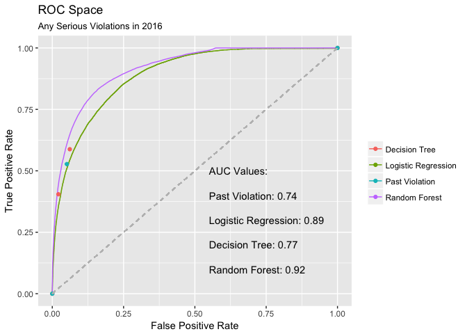

Violation Prediction Models
================

``` r
library(plyr)
library(rpart)
library(randomForest)
library(caret)
library(tidyverse)
library(magrittr)
library(stringr)
library(ROCR)

knitr::opts_knit$set(autodep=TRUE)

set.seed(2017)
```

Prep Data
=========

Create two data sets from training and testing models. The training data set (`df_15`) includes only violation data for 2013 and 2014 and an indicator for whether the property had any serious violations in 2015. The test data set (`df_16`) has violation data for 2014 and 2015 and an indicator for whether the property had any serious violations in 2016. The past years' violations indicators are renamed to be relative to the current year (eg. for 2015, 2014 becomes 1 and 2013 becomes 2). Later I plan to impute missing values, but for now I am simply dropping all records with missing data.

``` r
df <- feather::read_feather("../data/merged.feather") %>% na.omit()

df_15 <- df %>% 
  mutate(viol_bbl_ser_all_2015 = viol_bbl_bldg_ser_2015 + viol_bbl_apt_ser_2015,
         outcome = factor(viol_bbl_ser_all_2015 > 0)) %>% 
  select(-matches("2015|2016$"), -bbl, -block, -tract10) %>% 
  mutate(zoning = stringr::str_sub(zoning, 1, 1),
         building_class = stringr::str_sub(building_class, 1, 1)) %>%
  mutate_if(is.character, as.factor)

names(df_15) <- names(df_15) %>% str_replace_all("2014", "1") %>% str_replace_all("2013", "2")

df_16 <- df %>% 
  mutate(viol_bbl_ser_all_2016 = viol_bbl_bldg_ser_2016 + viol_bbl_apt_ser_2016,
         outcome = factor(viol_bbl_ser_all_2016 > 0)) %>% 
  select(-matches("2013|2016$"), -bbl, -block, -tract10) %>% 
  mutate(zoning = stringr::str_sub(zoning, 1, 1),
         building_class = stringr::str_sub(building_class, 1, 1)) %>%
  mutate_if(is.character, as.factor)

names(df_16) <- names(df_16) %>% str_replace_all("2015", "1") %>% str_replace_all("2014", "2")
```

------------------------------------------------------------------------

Serious violations in previous year
===================================

First I'll just simply use the presence of serious violations in 2015 to predict for 2016.

``` r
(past_viol_info <- confusionMatrix(df_15[["outcome"]], df_16[["outcome"]], 
                            positive = "TRUE", mode = "everything"))
```

    ## Confusion Matrix and Statistics
    ## 
    ##           Reference
    ## Prediction FALSE  TRUE
    ##      FALSE 25241  2984
    ##      TRUE   2842  3852
    ##                                           
    ##                Accuracy : 0.8332          
    ##                  95% CI : (0.8292, 0.8371)
    ##     No Information Rate : 0.8042          
    ##     P-Value [Acc > NIR] : < 2e-16         
    ##                                           
    ##                   Kappa : 0.4659          
    ##  Mcnemar's Test P-Value : 0.06471         
    ##                                           
    ##             Sensitivity : 0.5635          
    ##             Specificity : 0.8988          
    ##          Pos Pred Value : 0.5754          
    ##          Neg Pred Value : 0.8943          
    ##               Precision : 0.5754          
    ##                  Recall : 0.5635          
    ##                      F1 : 0.5694          
    ##              Prevalence : 0.1958          
    ##          Detection Rate : 0.1103          
    ##    Detection Prevalence : 0.1917          
    ##       Balanced Accuracy : 0.7311          
    ##                                           
    ##        'Positive' Class : TRUE            
    ## 

Using the presence of serious violations in 2015 to predict violations for 2016 achieves an accuracy of 0.8331567, which is only a slight improvement over the no information rate of 0.8042327. This simple prediction has a Kappa statistic of 0.4659488, its precision is 0.5754407 and recall is 0.5634874.

------------------------------------------------------------------------

Logit
=====

Next I fit a Logit model using all the attributes for the `df_15` training data set. I then get the predicted values on the `df_16` test data and iterate over threshold values, deciding on 0.5.

``` r
glm_fit <- glm(outcome ~ ., family = "binomial", df_15)

glm_p <- predict(glm_fit, df_16, type = "response")

print_results <- function(threshold, preditions) {
  ret <- if_else(preditions > threshold, TRUE, FALSE) %>% 
    as.factor %>% 
    confusionMatrix(df_16[["outcome"]])
  
  message(str_c("\nThreshold: ", threshold))
  print(ret)
}

# Use this to select a theshold - decided on 0.5
# walk(seq(0.1, 0.9, 0.1), print_results, preditions = glm_p)

(glm_info <- confusionMatrix(as.factor(glm_p > .5), df_16[["outcome"]], 
                             positive = "TRUE", mode = "everything"))
```

    ## Confusion Matrix and Statistics
    ## 
    ##           Reference
    ## Prediction FALSE  TRUE
    ##      FALSE 21295  1791
    ##      TRUE   6788  5045
    ##                                           
    ##                Accuracy : 0.7543          
    ##                  95% CI : (0.7498, 0.7588)
    ##     No Information Rate : 0.8042          
    ##     P-Value [Acc > NIR] : 1               
    ##                                           
    ##                   Kappa : 0.3888          
    ##  Mcnemar's Test P-Value : <2e-16          
    ##                                           
    ##             Sensitivity : 0.7380          
    ##             Specificity : 0.7583          
    ##          Pos Pred Value : 0.4264          
    ##          Neg Pred Value : 0.9224          
    ##               Precision : 0.4264          
    ##                  Recall : 0.7380          
    ##                      F1 : 0.5405          
    ##              Prevalence : 0.1958          
    ##          Detection Rate : 0.1445          
    ##    Detection Prevalence : 0.3389          
    ##       Balanced Accuracy : 0.7481          
    ##                                           
    ##        'Positive' Class : TRUE            
    ## 

The Logit model achieves an accuracy of 0.7543171, which is only a slight improvement over the previous year's violation prediction and even better than the no information rate of 0.8042327. The Logit model achieves a Kappa statistic of 0.3887847, its precision is 0.42635, and recall is 0.7380047.

------------------------------------------------------------------------

Decision Tree
=============

Next I try a simple decision tree with 10 times 10-fold Cross-validation.

``` r
tree_fit_control <- trainControl(method = "repeatedcv", number = 10, repeats = 10)

tree_fit <- train(outcome ~ ., data = df_15, 
                  method = "rpart", 
                  trControl = tree_fit_control)

tree_p <- predict(tree_fit, df_16)

(tree_info <- confusionMatrix(tree_p, df_16[["outcome"]], positive = "TRUE", mode = "everything"))
```

    ## Confusion Matrix and Statistics
    ## 
    ##           Reference
    ## Prediction FALSE  TRUE
    ##      FALSE 25612  2973
    ##      TRUE   2471  3863
    ##                                           
    ##                Accuracy : 0.8441          
    ##                  95% CI : (0.8402, 0.8479)
    ##     No Information Rate : 0.8042          
    ##     P-Value [Acc > NIR] : < 2.2e-16       
    ##                                           
    ##                   Kappa : 0.4907          
    ##  Mcnemar's Test P-Value : 1.12e-11        
    ##                                           
    ##             Sensitivity : 0.5651          
    ##             Specificity : 0.9120          
    ##          Pos Pred Value : 0.6099          
    ##          Neg Pred Value : 0.8960          
    ##               Precision : 0.6099          
    ##                  Recall : 0.5651          
    ##                      F1 : 0.5866          
    ##              Prevalence : 0.1958          
    ##          Detection Rate : 0.1106          
    ##    Detection Prevalence : 0.1814          
    ##       Balanced Accuracy : 0.7386          
    ##                                           
    ##        'Positive' Class : TRUE            
    ## 

The decision tree's accuracy of 0.8440963, is a further improvement over the accuracy Logit model, the previous year's violation prediction, and no information rate. The decision tree model also achieves an improved Kappa statistic of 0.4907399, and its precision is 0.6098832, and recall is 0.5650965.

``` r
varImp(tree_fit)
```

    ## rpart variable importance
    ## 
    ##   only 20 most important variables shown (out of 72)
    ## 
    ##                     Overall
    ## viol_bbl_apt_oth_1  100.000
    ## viol_bbl_apt_ser_1   92.494
    ## viol_bbl_apt_oth_2   79.166
    ## res_sqft             56.990
    ## viol_bbl_bldg_oth_1  46.629
    ## res_units             9.443
    ## viol_bbl_apt_ser_2    7.331
    ## assessed_value        3.080
    ## lot_area              2.686
    ## building_classZ       0.000
    ## cd                    0.000
    ## zoningP               0.000
    ## viol_blk_apt_ser_2    0.000
    ## new_lot               0.000
    ## building_classJ       0.000
    ## building_classR       0.000
    ## building_classD       0.000
    ## viol_bbl_bldg_ser_1   0.000
    ## building_classH       0.000
    ## basement_code         0.000

As expected, the various indicators of a building's violation record in the current and previous year are the most important attributes for predicting the presence of serious violations in the subsequent year. Additionally, the building's total residential square footage and total lot area, as well as the number of residential units and the total assessed value in the current year are also important.

------------------------------------------------------------------------

Random Forest
=============

Finally, I use a Random Forest model with 10-fold Cross-validation.

``` r
forest_fit_control <- trainControl(method = "repeatedcv", number = 5)

forest_fit <- train(outcome ~ ., data = df_15, 
                    method = "rf", 
                    tuneGrid=data.frame(mtry=3),
                    trControl = forest_fit_control)

forest_p <- predict(forest_fit, newdata = df_16)

(forest_info <- confusionMatrix(forest_p, df_16[["outcome"]], positive = "TRUE", mode = "everything"))
```

    ## Confusion Matrix and Statistics
    ## 
    ##           Reference
    ## Prediction FALSE  TRUE
    ##      FALSE 25650  2766
    ##      TRUE   2433  4070
    ##                                           
    ##                Accuracy : 0.8511          
    ##                  95% CI : (0.8473, 0.8548)
    ##     No Information Rate : 0.8042          
    ##     P-Value [Acc > NIR] : < 2.2e-16       
    ##                                           
    ##                   Kappa : 0.5183          
    ##  Mcnemar's Test P-Value : 4.135e-06       
    ##                                           
    ##             Sensitivity : 0.5954          
    ##             Specificity : 0.9134          
    ##          Pos Pred Value : 0.6259          
    ##          Neg Pred Value : 0.9027          
    ##               Precision : 0.6259          
    ##                  Recall : 0.5954          
    ##                      F1 : 0.6102          
    ##              Prevalence : 0.1958          
    ##          Detection Rate : 0.1166          
    ##    Detection Prevalence : 0.1862          
    ##       Balanced Accuracy : 0.7544          
    ##                                           
    ##        'Positive' Class : TRUE            
    ## 

The Random Forest outperforms all the previous models in terms of accuracy with a value of 0.8511126. This still is only a slight improvement over all the previous models, and still is only modestly more accurate than the no information rate or previous year's violation prediction of 0.8331567 and 0.8042327, respectively. The Random Forest also has a Kappa statistic of 0.5182922, and its precision is 0.625865, and recall is 0.5953774.

``` r
varImp(forest_fit)
```

    ## rf variable importance
    ## 
    ##   only 20 most important variables shown (out of 72)
    ## 
    ##                      Overall
    ## viol_bbl_apt_oth_1    100.00
    ## viol_bbl_apt_ser_1     73.62
    ## res_sqft               61.86
    ## viol_bbl_apt_oth_2     61.62
    ## res_units              49.90
    ## assessed_value         48.38
    ## lot_area               46.86
    ## viol_trct_bldg_oth_1   42.08
    ## viol_trct_bldg_ser_1   40.59
    ## viol_blk_bldg_oth_1    37.46
    ## viol_blk_apt_ser_1     36.14
    ## viol_trct_bldg_oth_2   35.89
    ## viol_blk_apt_oth_1     35.84
    ## viol_trct_apt_oth_2    35.83
    ## viol_trct_apt_oth_1    34.87
    ## viol_trct_apt_ser_1    33.85
    ## viol_bbl_bldg_oth_1    32.43
    ## viol_bbl_bldg_ser_1    32.31
    ## viol_blk_apt_oth_2     31.68
    ## viol_trct_apt_ser_2    30.42

Many of the variables that were important in the single decision tree are also important in the Random Forest model. Others that were important include the number of floors in the building, the Community District in which it is located, and the year it was built.

------------------------------------------------------------------------

Comparing Models
================

Next I'll get the predictions of all the models, and store the names and predictions of the models.

``` r
past_viol_pred <- prediction(as.numeric(df_15[["outcome"]]), df_16[["outcome"]])

glm_pred <- prediction(as.numeric(glm_p), df_16[["outcome"]])

tree_pred <- tree_fit %>% 
  predict(newdata = df_16, type = "prob") %>% 
  .[[2]] %>%
  prediction(df_16[["outcome"]])

forest_pred <- forest_fit %>% 
  predict(newdata = df_16, type = "prob") %>% 
  .[[2]] %>%
  prediction(df_16[["outcome"]])

model_preds <- list(past_viol_pred, glm_pred, tree_pred, forest_pred)

model_names <- c("Past Violation", "Logistic Regression", "Decision Tree", "Random Forest")
```

I'll also save predictions from the models into a data frame for additional analysis and mapping in later scripts.

``` r
predictions <- tibble(bbl = df[["bbl"]],
                      true_16 = df_16[["outcome"]] %>% as.logical %>% as.numeric, 
                      past_viol = df_15[["outcome"]] %>% as.logical %>% as.numeric,
                      logit = glm_pred@predictions %>% as_vector,
                      tree = tree_pred@predictions %>% as_vector,
                      forest = forest_pred@predictions %>% as_vector)

feather::write_feather(predictions, "../data/model_predictions_16.feather")
```

ROC Space
---------

In addition the the various statistics generated above, it is helpful to visualize the performance of the various models by plotting the models' true positive and false positive rates in a ROC space. Only the Logit model can be plotted as a ROC curve and have an AUC calculated, while the others are represented simply by points in the ROC space.

``` r
get_roc_df <- function(.pred, model_name) {
  .pred %>% 
  performance("tpr", "fpr") %$% 
  tibble(model = model_name,
         fpr = .@x.values[[1]],
         tpr = .@y.values[[1]],
         cutoff = .@alpha.values[[1]])
}

get_auc <- function(.pred) {
  performance(.pred, "auc")@y.values[[1]]
}

roc_data <- map2_df(model_preds, model_names, get_roc_df) %>% 
  mutate(model = ordered(model, model_names))

auc_values <- set_names(model_preds, model_names) %>% map_dbl(get_auc)

roc_line_data <- filter(roc_data, model %in% c("Logistic Regression", "Random Forest"))
roc_point_data <- anti_join(roc_data, roc_line_data, by = "model")

roc_line_data %>% 
  ggplot(aes(fpr, tpr, color = model)) + 
  geom_line() +
  geom_point(data = roc_point_data) +
  geom_segment(x = 0, xend = 1, y = 0, yend = 1, linetype = "dashed", color = "grey") +
  annotate("text", x = .55, y = .5, hjust = 0, label = "AUC Values:") +
  annotate("text", x = .55, y = c(.4, .3, .2, .1), hjust = 0,
           label = str_c(names(auc_values), ": ", round(auc_values, 2))) +
  labs(title = "ROC Space",
       subtitle = "Any Serious Violations in 2016",
       color = NULL, x = "False Positive Rate", y = "True Positive Rate")
```



Precision-Recall Space
----------------------

Since the no-information accuracy for prediting violations is realatively high, at 0.8042327, and given that in different potential applications of these predictions we may be particualarily concerend about false positive vs false negatives, it is especially useful to look at the tradeoff between precision and recall for the models. I do this below by ploting the modelss precision-recall curves (or points).

``` r
get_prec_rec_df <- function(.pred, model_name) {
  .pred %>% 
  performance("prec", "rec") %$% 
  tibble(model = model_name,
         recall = .@x.values[[1]],
         precision = .@y.values[[1]],
         cutoff = .@alpha.values[[1]])
}

prec_rec_data <- map2_df(model_preds, model_names, get_prec_rec_df) %>% 
  mutate(model = ordered(model, model_names),
         precision = if_else(is.nan(precision), 1, precision))

prec_rec_line_data <- filter(prec_rec_data, model %in% c("Logistic Regression", "Random Forest"))
prec_rec_point_data <- anti_join(prec_rec_data, prec_rec_line_data, by = "model")

prec_rec_line_data %>% 
  ggplot(aes(recall, precision, color = model)) + 
  geom_line() +
  geom_point(data = prec_rec_point_data) +
  labs(title = "Precision-Recall Space",
       subtitle = "Any Serious Violations in 2016",
       color = NULL, x = "Recall", y = "Precision")
```


