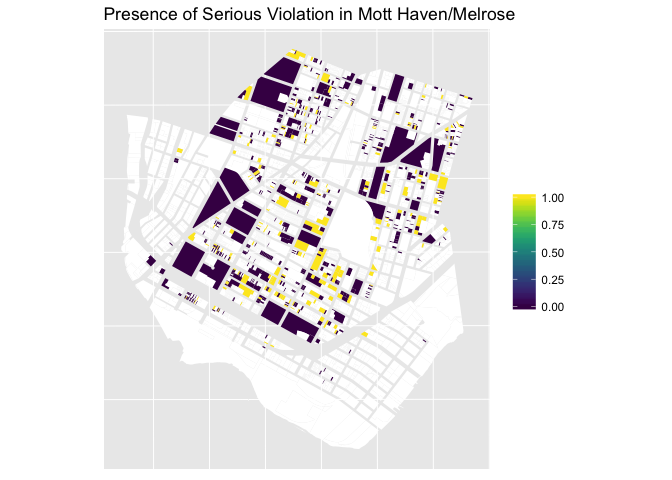
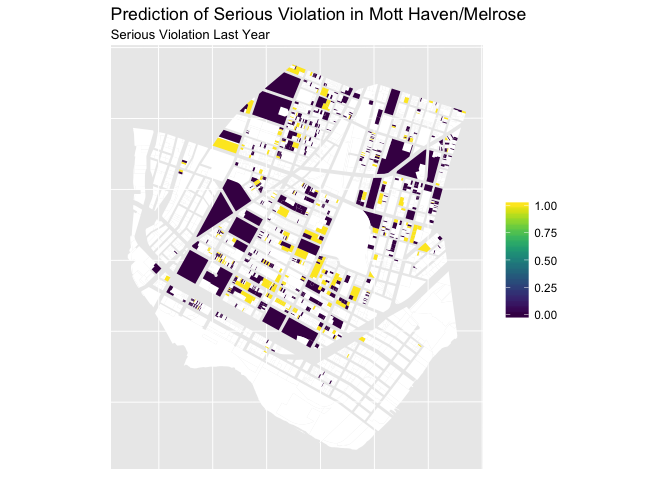
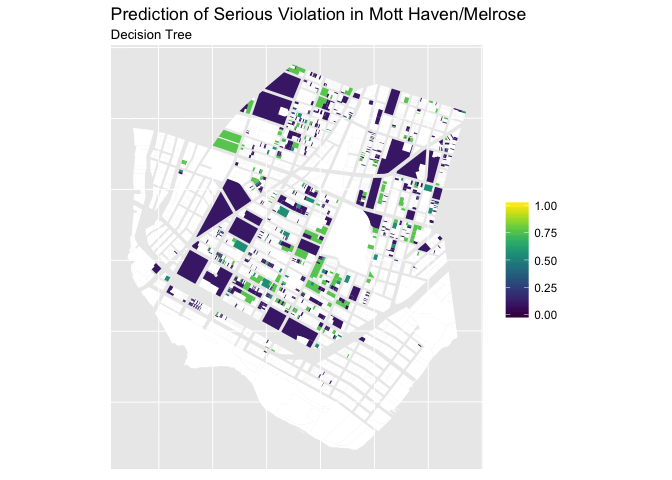
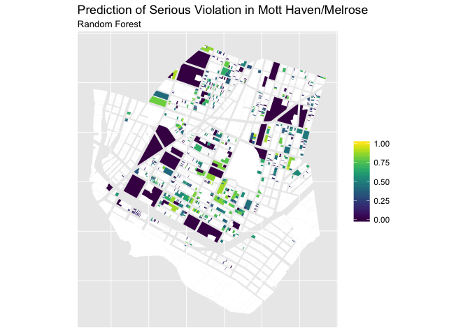

Predicted Violations Maps
================

``` r
library(feather)
library(ggplot2)
library(dplyr)
library(sf)
```

``` r
pred <- read_feather("../data/model_predictions_16.feather")
bx <- st_read("../data-raw/dcp_mappluto/BXMapPLUTO.shp", "BXMapPLUTO")

cd <- bx %>% 
  filter(CD == 201) %>% 
  mutate(bbl = as.character(BBL)) %>% 
  select(bbl, geometry) %>% 
  left_join(pred, by = "bbl")
```

``` r
ggplot(cd) + 
  geom_sf(aes(fill = true_16), color = NA) + 
  viridis::scale_fill_viridis(na.value = "white", limits = c(0, 1)) +
  theme(axis.ticks = element_blank(), axis.text = element_blank()) +
  labs(title = "Presence of Serious Violation in Mott Haven/Melrose",
       fill = NULL)
```



``` r
ggplot(cd) + 
  geom_sf(data = cd, aes(fill = past_viol), color = NA) + 
  viridis::scale_fill_viridis(na.value = "white", limits = c(0, 1)) +
  theme(axis.ticks = element_blank(), axis.text = element_blank()) +
  labs(title = "Prediction of Serious Violation in Mott Haven/Melrose",
       subtitle = "Serious Violation Last Year",
       fill = NULL)
```



``` r
ggplot(cd) + 
  geom_sf(data = cd, aes(fill = tree), color = NA) + 
  viridis::scale_fill_viridis(na.value = "white", limits = c(0, 1)) +
  theme(axis.ticks = element_blank(), axis.text = element_blank()) +
  labs(title = "Prediction of Serious Violation in Mott Haven/Melrose",
       subtitle = "Decision Tree",
       fill = NULL)
```



``` r
ggplot(cd) + 
  geom_sf(data = cd, aes(fill = forest), color = NA) + 
  viridis::scale_fill_viridis(na.value = "white", limits = c(0, 1)) +
  theme(axis.ticks = element_blank(), axis.text = element_blank()) +
  labs(title = "Prediction of Serious Violation in Mott Haven/Melrose",
       subtitle = "Random Forest",
       fill = NULL)
```


