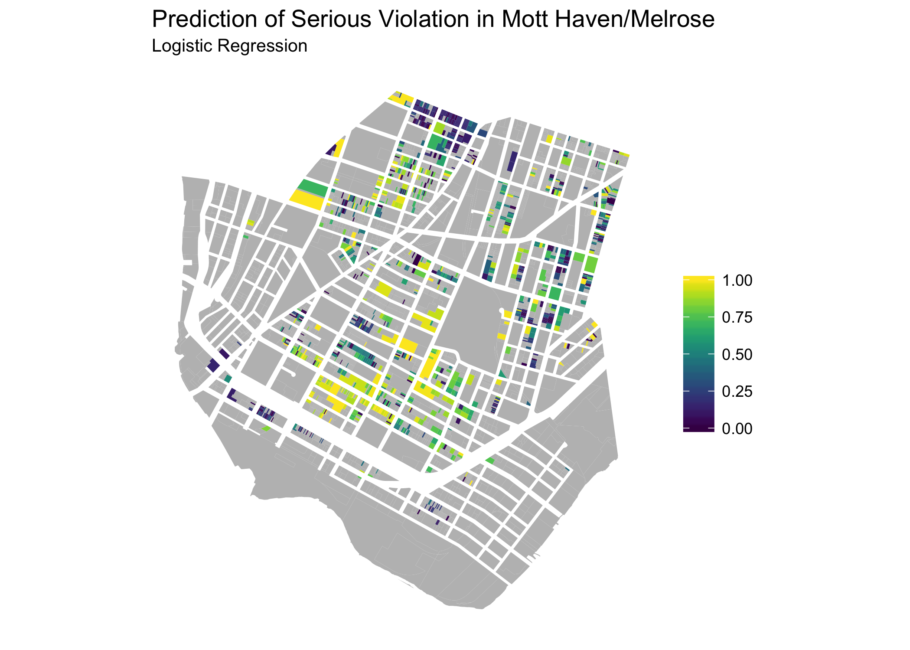

```{r setup, include=FALSE}
options(htmltools.dir.version = FALSE)
knitr::opts_knit$set(root.dir = here::here())
```

```{r, message=FALSE, warning=FALSE, include=FALSE}
library(tidyverse)
library(feather)
```

class: inverse, center, middle

# Recap

---
## Topic Motivation

Legal Aid and other organizations have resources to proactively seek out cases

Identifying buildings likely to benefit from such organizations helps the organizations to efficiently target outreach

Serious housing code violations and can serve as proxy for overall harmfull conditions for tenants

## Project Goal

Use variety of available data sources to predict future presence of serious housing code violations

This prject would be a success if I can predict the liklihood of a buildings to have serious violations significantly better than naive methods 

---
class: inverse, center, middle

# Data

---
## Data Sources

Variety of (mostly) public data sets, largely from NYC Open Data
  * Phycial characteristics of buildings
  * History of violations and litigation

## Munging

* Download raw data and documentation files

* Select and clean variables

* Restrict to privately-owned rental units

* Adjust apartment-level violations by number of units

* Add block- and tract-level violation aggregates

* Reshape to building-level data set

---
class: inverse, center, middle

# Descriptives

```{r, message=FALSE, warning=FALSE, include=FALSE}
df <- read_feather("data/merged.feather") %>% 
  mutate(viol_ser_adj = viol_bbl_bldg_ser_2016 + viol_bbl_apt_ser_2016,
         viol_ser_any = viol_ser_adj > 0)
```

---
class: center, middle

```{r viol-by-size, echo=FALSE, fig.width=7, fig.height=5, out.width='100%'}
df %>% 
  filter(res_units <= 200) %>% 
  group_by(res_units) %>%
  summarise(avg_viol_ser_all_2016 = mean(viol_ser_adj, na.rm = TRUE)) %>% 
  ggplot(aes(res_units, avg_viol_ser_all_2016)) + 
  geom_point() +
  theme(plot.caption = element_text(colour = "grey50", face = "italic", size = 8)) +
  labs(title = "Adjusted Average Number of Serious Violations, by Building Size",
       subtitle = "New York City, 2016",
       caption = "Graph truncated at 200 residential units",
       y = NULL, x = "Number of Residential Units in Property")
```

---

background-image: url(../maps/tract_violations_rate_2016.png) 
background-size: contain

---
class: inverse, center, middle

# Models

---

## Model Performance Statistics

```{r results='asis', echo=FALSE}
keep_stats <- c("Accuracy", "AccuracyPValue", "Balanced Accuracy", "AccuracyNull", "Kappa",
                "McnemarPValue", "F1", "Sensitivity", "Specificity", "Precision", "Recall")

model_stat_table <- read_feather("data/model_stat_table.feather") %>% 
  filter(Statistic %in% keep_stats) %>% 
  mutate(Statistic = ordered(Statistic, keep_stats)) %>% 
  arrange(Statistic)

knitr::kable(model_stat_table, format = "html")
```

---
## Variable Importance
### Decision Tree & Random Forest

* Serious and non-serious violations at building in previous two year

* Residential Square Footage

* Residential Units

* Total Lot Area

* Assessed Value

* Rate of Serious and non-serious violations in Block and Tract


---

background-image: url(../analysis/models_files/figure-markdown_github/roc-curve-1.png)
background-size: contain

---

background-image: url(../analysis/models_files/figure-markdown_github/pr-curve-1.png)
background-size: contain

---
class: inverse, center, middle

# Next Steps

---
## Data Prep

Impute missing values in building characteristic variables (year built, etc.)

Add more data sets:
  * Violation complaints
  * Emergency repairs
  * Corporate owner
  * Building permits
  * Certificates of occupancy
  * Property sales
  * Building violations
  * Boiler information
  * Rodent inspections
  * Subsidized housing
  * Rent-regulated units
  * Property tax delinquencies
  * American Community Survey
  * Housing Vacancy Survey 
  
---
## Additional analysis

Try additional models 

Analyze variable importance further

Write up results of model evaluation

Experiment with presentation of prediction results

---
```{r, echo=FALSE, out.width='100%'}

```
---
```{r, echo=FALSE, out.width='100%'}

```
---
```{r, echo=FALSE, out.width='100%'}

```
---
```{r, echo=FALSE, out.width='100%'}

```
---
```{r, echo=FALSE, out.width='100%'}

```
---
class: inverse, center, middle

# Thanks!

Slides created via the R package [**xaringan**](https://github.com/yihui/xaringan).

